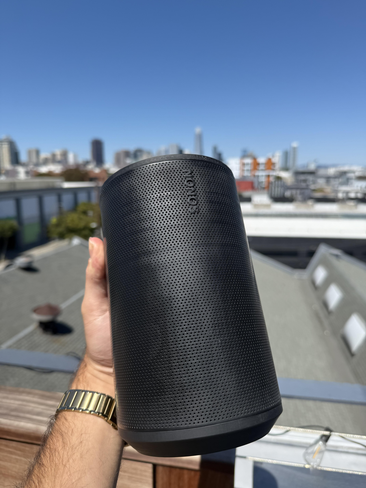

# NONOS

### The Open Source Smart Speaker Built with [atopile](https://atopile.io) ⚡

<div align="center">
  
  
  
  **Premium Sound • Privacy First • Fully Hackable**
  
  [](https://atopile.io)
  [](https://opensource.org/licenses/MIT)
  [](https://github.com/atopile/nonos/pulls)
  
</div>

---

## 🎵 Experience Audio Freedom

NONOS is a premium smart speaker that puts you in control. Built entirely with open-source hardware and powered by **[atopile](https://atopile.io)**, it delivers exceptional sound quality while respecting your privacy.

### ✨ Key Features

<table>
<tr>
<td width="50%">

**🔊 Audiophile-Grade Sound**

- Dual-driver system with dedicated tweeter and full-range speaker
- Texas Instruments TAS5825M Class-D amplifier
- Analog Devices ADAU145x DSP for pristine audio processing
- I2S digital audio interface for lossless playback

</td>
<td width="50%">

**🧠 Powerful Computing**

- Raspberry Pi CM5 module at its heart
- Gigabit Ethernet connectivity
- USB-C with Power Delivery support
- Multiple I2C, UART, and GPIO interfaces

</td>
</tr>
<tr>
<td width="50%">

**🎨 Interactive Design**

- 23 SK6805 addressable RGB LEDs
- Capacitive touch controls with volume slider
- NFC tap-to-pair functionality
- Minimalist cylindrical form factor

</td>
<td width="50%">

**⚡ Smart Power Management**

- USB-C Power Delivery (20V input)
- Efficient buck converters (5V & 3.3V rails)
- STUSB4500 PD controller
- Low standby power consumption

</td>
</tr>
</table>

---

## 🎶 Software Features

### Streaming Services

Connect and play from all your favorite sources:

- **Spotify Connect** - Stream directly from the Spotify app
- **AirPlay** - Native support for Apple devices
- **Bluetooth Audio** - Auto-pairing A2DP streaming
- **Local Playback** - Play your music library via network shares

### Smart Controls

Intuitive touch interface with gesture support:

- **Play/Pause** - Center button for media control
- **Track Navigation** - Skip tracks or seek within songs
- **Volume Slider** - 5-position touch slider with double-tap gestures
  - Double-tap position 0 for mute
  - Double-tap position 4 for +6dB boost
- **Configurable EQ** - 15-band parametric equalizer

### Audio Excellence

Professional-grade DSP processing:

- **Crossover Networks** - Optimized for dual-driver configuration
- **Dynamic Range Control** - Independent limiting for highs and lows
- **Mid-Side Processing** - Adjustable stereo width
- **PipeWire Integration** - Low-latency audio with automatic resampling

---

## 🎛️ Hardware Highlights

### Audio Processing Pipeline

```
CM5 (Digital Audio) → I2S → ADAU145x DSP → I2S → TAS5825M Amplifier → Speakers
```

### Interactive Hat Module

- **NFC**: PN5321 for instant device pairing
- **Touch**: CAP1188 capacitive sensor (3 buttons + 5-position slider)
- **LEDs**: 23x SK6805 RGB LEDs in a circular array
- **Level Shifting**: Ensures reliable 3.3V/5V communication

### Debug Headers

Three Saleae-compatible headers for easy development:

- UART console access
- I2C bus monitoring
- I2S audio stream analysis

---

## 🛠️ Built with atopile

NONOS showcases the power of **[atopile](https://atopile.io)** - the language that makes hardware design as easy as software. Every component, connection, and power rail is defined in clean, readable `.ato` files.

```ato
module NONOS:
    """
    An opensource sonos era 100 clone
    """

    # Core Components
    cm5 = new CM5
    amplifier = new Texas_Instruments_TAS5825MRHBR_driver
    dsp = new Analog_Devices_ADAU145x_driver
    pd_controller = new STUSB4500

    # Smart Power Distribution
    pd_controller.power_out ~ power_20v
    power_20v ~> regulator_5v ~> power_5v
    power_5v ~> regulator_3v3 ~> power_3v3
```

### 📁 Project Structure

```
nonos/
├── elec/
│   └── src/
│       ├── nonos.ato      # Main speaker module
│       ├── hat.ato        # Touch/LED/NFC interface
│       └── parts/         # Component library
├── firmware/              # CM5 software stack
├── mechanical/            # Enclosure designs
└── docs/                  # Build instructions
```

---

## 🚀 Getting Started

### Prerequisites

- **[atopile](https://atopile.io/getting-started)** compiler installed
- KiCad 8.0 or later (for PCB viewing/editing)
- Basic SMD soldering equipment

### Building NONOS

1. **Clone the repository**

   ```bash
   git clone https://github.com/atopile/nonos
   cd nonos
   ```

2. **Compile the hardware design**

   ```bash
   ato build
   ```

3. **Generate manufacturing files**

   ```bash
   ato build -t mfg
   ```

4. **Order PCBs and components**
   - Upload gerbers to your preferred PCB manufacturer
   - Use the generated BOM for component ordering

---

## 🤝 Contributing

We love contributions! Whether it's:

- 🐛 Bug fixes
- ✨ New features
- 📚 Documentation improvements
- 🎨 Design enhancements

---

## 📄 License

NONOS is open source hardware, released under the MIT License. See [LICENSE](LICENSE) for details.

---

## 🌟 Acknowledgments

Built with ❤️ using **[atopile](https://atopile.io)** - the language that's revolutionizing hardware design.

Special thanks to the atopile community for making hardware development accessible to everyone.

---

<div align="center">
  
**Ready to build your own NONOS?**

[📖 Read the Docs](https://github.com/atopile/nonos) • [💬 Join Discord](https://discord.gg/C9kZgkGS) • [⭐ Star on GitHub](https://github.com/atopile/nonos)

</div>
